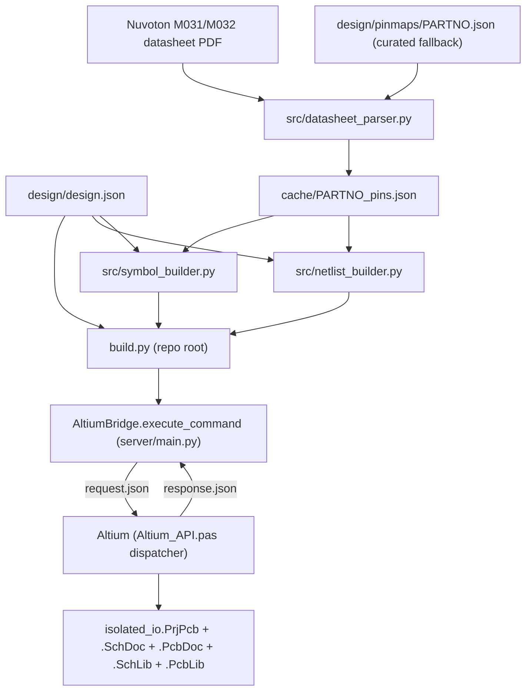

# Altium Automated Project Builder — Implementation Plan

## 0. Reality check vs. the brief (must read first)

The brief references files that DO NOT exist in this repo. Confirmed actual architecture:

- There is no `server/tools/schematic.py`. ALL MCP tools live in one file: [server/main.py](server/main.py) (a `FastMCP` server, `@mcp.tool()` functions).
- There is no `server/utils/send_to_altium.py`. The bridge is the `AltiumBridge` class in [server/main.py](server/main.py) — `execute_command(command, params)` writes `C:\Users\Public\altium_mcp\request.json`, launches `X2.EXE -RScriptingSystem:RunScript(...Altium_API>Run)`, polls for `response.json`.
- Pascal handlers live in [server/AltiumScript/Altium_API.pas](server/AltiumScript/Altium_API.pas) (the dispatcher `ExecuteCommand` + per-command `Execute*` request parsers) and the worker `.pas` units [schematic_utils.pas](server/AltiumScript/schematic_utils.pas), [pcb_utils.pas](server/AltiumScript/pcb_utils.pas), [other_utils.pas](server/AltiumScript/other_utils.pas), [json_utils.pas](server/AltiumScript/json_utils.pas). Units are registered in [Altium_API.PrjScr](server/AltiumScript/Altium_API.PrjScr).

Therefore every "add tool to server/tools/schematic.py and Pascal handler" maps to: (1) add `@mcp.tool()` in `server/main.py`; (2) add an `Execute<Cmd>` parser + a `case` arm in `Altium_API.pas`; (3) add the worker function in the relevant `.pas` unit; (4) register any new unit in `Altium_API.PrjScr`. We extend the existing pattern verbatim — no new transport.

### Critical behavioral facts the implementation depends on
- The bridge runs **one command per Altium script launch**, but Altium stays running, so **open project/document state persists between commands**. `build.py` issues commands sequentially; each one finds the project/docs left open by the previous one. This is the backbone of the whole flow.
- `ExecuteCommand` calls `EnsureDocumentFocused(CommandName)` first ([other_utils.pas](server/AltiumScript/other_utils.pas) L168). New "creation" commands must be added to its early-return allow-list (like `search_library_symbol`/`create_pcb_footprint`) so they aren't blocked when no design doc is open yet.
- Request JSON is parsed **line-by-line** in Pascal; `json.dump(..., indent=2)` guarantees one field per line. Arrays are scanned until `]`. New parsers must follow `ParseAssignmentsList`/`ExecuteCreateSchematicSymbol` exactly.
- `place_net_labels`/`place_power_ports` match a pin by `Pin.Name` OR `Pin.Designator` ([schematic_utils.pas](server/AltiumScript/schematic_utils.pas) L1245). So if the MCU symbol's pin *names* are the port names (PA0, PA1, …), we can label nets by port name and never hardcode physical pin numbers for connectivity.

---

## 1. Architecture & data flow



`build.py` reuses the existing `AltiumBridge` directly (same pattern as [server/tests/check_schematic_live.py](server/tests/check_schematic_live.py): `sys.path.insert(0, 'server'); from main import altium_bridge`). It does NOT go through the MCP layer, so it works as a plain CLI while the same handlers remain available as MCP tools.

---

## 2. (a) New files to create

- `PLAN.md` — this plan, written to repo root as first implementation action.
- `design/design.json` — full project spec (schema in §6). MCU swap = edit `mcu` + `mcu_package` only.
- `design/pinmaps/M031FB0AE.json` — curated, hand-verified TSSOP20 pin table (authoritative fallback + validation oracle for the parser).
- `design/pinmaps/M031EB0AE.json` — curated LQFP32 pin table (for the swap test).
- `src/__init__.py` — package marker.
- `src/datasheet_parser.py` — part number -> `[{pin_num, pin_name, pin_type, alt_functions[]}]`; pdfplumber primary, curated pinmap fallback; caches to `cache/PARTNO_pins.json`; prints table to stdout.
- `src/symbol_builder.py` — parsed pins + grouping rules -> exact `create_schematic_symbol` pin-string list (`"num|name|type|orient|x|y|owner"`).
- `src/netlist_builder.py` — design.json + pin table -> ordered `place_net_labels`/`place_power_ports` assignment lists + the passive/discrete component list (Rs, pull-ups, the opto/transistor support parts).
- `src/altium_client.py` — thin synchronous wrapper around `AltiumBridge.execute_command` with `--dry-run`/`--verbose` plumbing, retry, and partial-failure reporting (keeps `build.py` readable; pure glue).
- `build.py` — orchestrator CLI (sequence in §5).
- `server/AltiumScript/project_utils.pas` — NEW Pascal unit: `CreateProject`, `CreateSchematicSheet`, `CreatePcbDocument`, `CreateSchematicLibrary`, `CreatePcbLibrary`, `SyncToPcb`. Registered as `Document7` in `Altium_API.PrjScr`.
- `cache/` — created at runtime (gitignored).
- `lib/` setup: `src/footprint_setup.py` drives creation of `lib/footprints.PcbLib` via the existing `create_pcb_footprint` primitive (see §8). No binary lib is hand-authored.
- `SWAP_TEST.md` — results of Step 13 (created during that step).
- Tests: `server/tests/test_datasheet_parser.py`, `test_symbol_builder.py`, `test_netlist_builder.py` (pure-Python, no Altium), and `server/tests/check_build_live.py` (live smoke).
- `src/visual_checker.py` — visual rule definitions and screenshot evaluation via Claude vision API (`anthropic` package). Called by `verify_step()` in `build.py`. Defines `VisualRule`, `Violation`, `Correction`, `RuleResult` dataclasses and `evaluate_visual_rules()`.
- `tests/test_step1_design_json.py` — pytest for `design.json` schema validation (required keys, debug_pins consistency, net_names completeness).
- `tests/test_step2_parser.py` — pytest for `datasheet_parser` correctness (known pins present, alt_functions populated, curated fallback activates).
- `tests/test_step3_symbol_builder.py` — pytest for `symbol_builder` JSON format and grouping rules (left/right/top/bottom assignment, pin count per side matches 20-pin and 32-pin variants).
- `tests/test_step11_netlist_builder.py` — pytest for net assignment completeness (all signal/power/debug nets present, no unresolved ICE pins, passive count matches design.json).
- `tests/test_log.md` — auto-written by `build.py` after every `verify_step()` call; one entry per step with pass/warn/fail status and screenshot path.

## 2. (b) Existing files to modify

- [server/main.py](server/main.py): add `@mcp.tool()` wrappers — `create_project`, `create_schematic_sheet`, `create_pcb_document`, `create_schematic_library`, `create_pcb_library`, `place_component`, `assign_footprint`, `sync_to_pcb`. (Library-creation tools are gaps the brief omits but Steps 6/10 require them; `create_schematic_symbol`/`create_pcb_footprint` need a focused lib.)
- [server/AltiumScript/Altium_API.pas](server/AltiumScript/Altium_API.pas): add `Execute*` request parsers and `case` arms for each new command in `ExecuteCommand` (L798).
- [server/AltiumScript/other_utils.pas](server/AltiumScript/other_utils.pas): extend `EnsureDocumentFocused` (L168) — add the `create_*` commands to the early-return allow-list; route `place_component`/`assign_footprint`/`sync_to_pcb` to `DocumentKind := 'SCH'`.
- [server/AltiumScript/schematic_utils.pas](server/AltiumScript/schematic_utils.pas): add `PlaceLibraryComponent` (Step 7) and `AssignFootprintToComponent` (Step 8) workers.
- [server/AltiumScript/Altium_API.PrjScr](server/AltiumScript/Altium_API.PrjScr): add `[Document7] DocumentPath=project_utils.pas`.
- Build-only Python deps: add `pdfplumber`, `requests` to a new `requirements-build.txt` (kept OUT of the `.dxt` runtime `REQUIREMENTS` in `start_server.py` to avoid bloating the extension).
- `.gitignore`: add `cache/`, `*.PrjPcb`/generated design outputs under a build output dir.

## 2. (c) New MCP tools (name | inputs | outputs | Pascal worker)

- `create_project` | `{project_name, project_path}` | `{success, project_path, project_file}` | `CreateProject`
- `create_schematic_sheet` | `{sheet_name, project_file_path}` | `{success, sheet_path}` | `CreateSchematicSheet`
- `create_pcb_document` | `{pcb_name, project_file_path}` | `{success, pcb_path}` | `CreatePcbDocument`
- `create_schematic_library` | `{lib_name, project_file_path}` | `{success, lib_path}` | `CreateSchematicLibrary` — **must end with `Client.ShowDocument` on the new lib so the caller can immediately call `create_schematic_symbol` without a separate focus step**
- `create_pcb_library` | `{lib_name, project_file_path}` | `{success, lib_path}` | `CreatePcbLibrary`
- `focus_document` | `{document_path}` | `{success, document_kind}` | `FocusDocument` — opens and focuses any already-created document by path; used between Steps 6 and 8 to re-focus the SchLib after PcbLib creation shifts focus. Added to the `EnsureDocumentFocused` allow-list (skips the focus check, does its own).
- `place_component` | `{library_path, symbol_name, designator, x, y}` | `{success, designator, actual_x_mils, actual_y_mils}` | `PlaceLibraryComponent` — **x and y are in mils**; the Pascal worker calls `MilsToCoord()` internally.
- `assign_footprint` | `{designator, footprint_ref, footprint_library_path}` | `{success, designator, footprint_assigned}` | `AssignFootprintToComponent`
- `sync_to_pcb` | `{}` | `{success, eco_changes:[...]}` | `SyncToPcb`
- `move_component` | `{designator, dx_mils, dy_mils}` | `{success, new_x, new_y}` | `MoveComponent` — finds component by `Designator.Text`, shifts `Location` by `MilsToCoord(dx)` / `MilsToCoord(dy)`; PreProcess/PostProcess/GraphicallyInvalidate wrapped. Used exclusively by the visual correction loop (Rules 2, 3, 4, 6, 7).
- `rotate_component` | `{designator, angle_degrees}` | `{success, designator, angle}` | `RotateComponent` — sets component `Orientation` property (0=0°, 1=90°, 2=180°, 3=270°, mapped from degrees); PreProcess/PostProcess wrapped. Used by visual correction loop Rule 5 (power port orientation). Both added to the `EnsureDocumentFocused` routing for `DocumentKind := 'SCH'`.

Reused as-is: `create_schematic_symbol`, `place_net_labels`, `place_power_ports`, `get_unconnected_pins`, `create_pcb_footprint`, `connect_pins`, `get_pin_nets`.

## 2. (i) Altium API calls for project/document creation — VERIFIED + fallbacks

Verified against Altium DXP Developer / WSM docs during research:
- `GetWorkspace : IWorkspace` (EDPUtil) — already used throughout this codebase.
- `IProject.DM_AddSourceDocument(Filename)` — adds an existing file to the focused project. (Documented.)
- New documents via Workspace Manager process `WorkspaceManager:OpenObject` with `ObjectKind=NewAnything|Kind=SCH` (schematic), `Kind=DefaultPcb` (PCB), `Kind=SCHLIB`, `Kind=DefaultPcbLib`. It creates + opens the doc in the active/focused project. (Documented in OpenObject reference.)
- `IServerDocument.DoFileSave(kind)` / `DoFileSaveAs` and `Client.OpenDocument` / `Client.ShowDocument` — already used in this repo (`SearchLibrarySymbol`).
- `.PrjPcb` is a plain-text INI file (same family as the `.PrjScr` we already ship), so a project skeleton can be written to disk and opened.

The brief's hypothesized `WorkSpace.DM_CreateNewDocument('PCBProject')` is NOT a confirmed method name. Per the brief's own rule ("if an Altium API call is unverified, add a runtime check with a clear error"), each new Pascal creator uses a **layered strategy with try/except and a hard error if all paths fail** (never silent):
- `CreateProject`: (1) write a minimal valid `.PrjPcb` text skeleton to `project_path`, then `Client.OpenDocument('PCB_PROJECT', path)` + set focused; (2) fallback: `ResetParameters; AddStringParameter('ObjectKind','PCB_Project'); RunProcess('WorkspaceManager:OpenObject')` then `DoFileSaveAs`. Returns clear `ERROR:` if the project isn't focused afterward.
- `CreateSchematicSheet`/`CreatePcbDocument`/`Create*Library`: (1) `ResetParameters; AddStringParameter('ObjectKind','NewAnything'); AddStringParameter('Kind','<SCH|DefaultPcb|SCHLIB|DefaultPcbLib>'); RunProcess('WorkspaceManager:OpenObject')`, then `IServerDocument.DoFileSaveAs(target)`, then `Project.DM_AddSourceDocument(target)`; (2) fallback: `CreateNewDocumentFromDocumentKind('<KIND>')`. Each verifies the doc is current (`SchServer.GetCurrentSchDocument` / `PCBServer.GetCurrentPCBBoard` / `GetCurrentPCBLibrary`) and returns `ERROR:` otherwise. Sheet creator ends by `DM_OpenAndFocusDocument` so subsequent SCH tools target it.

---

## 5. (d) build.py execution sequence (numbered, exact)

`python build.py [--config design/design.json] [--dry-run] [--verbose] [--overwrite]`

**Coordinate units:** all x/y values passed to `place_component` and stored in `design.json` layout rules are in **mils** (1 mil = 0.001 inch). The Pascal worker converts with `MilsToCoord()` before placing. The 100-mil grid means component origins snap to multiples of 100.

**Exit codes:** `build.py` exits `0` on full success, `1` on any structural failure (hard abort), `2` on visual-only warnings (electrically correct but aesthetic issues flagged).

1. Load + validate `design.json` (schema check; required keys; net_names complete; debug_pins listed in both `connectors.debug_pins` and `net_names.debug` — fail loudly if they diverge). Run `pytest tests/` as pre-flight; abort if any test fails.
2. Check `--overwrite` flag and idempotency state (see §10.5). If `.build_state.json` exists and `--overwrite` is not set: resume silently from the last completed step. If project files exist at `project_path` but no `.build_state.json` is present (unknown prior state): **abort with a clear error** — `"ERROR: project files exist at <path> but no checkpoint found. Run with --overwrite to replace, or remove the directory manually."` Do not prompt interactively; the build must be fully headless.
3. Resolve MCU pin table: `datasheet_parser.parse(mcu)` — use `cache/{mcu}_pins.json` if present; else pdfplumber on the datasheet (auto-download to `cache/` if missing); else curated `design/pinmaps/{mcu}.json`. Print the formatted pin table.
4. `create_project` -> `.PrjPcb` at `project_path`. Then: `verify_step("create_project", structural_checks=structural_4, visual_rules=[])`.
5. `create_schematic_library` -> `<project_name>.SchLib`, returns `lib_path`. Log: `"SchLib focused: <path>"`. Then: `verify_step("create_schlib", structural_checks=structural_6a, visual_rules=[])`.
6. `create_pcb_library` -> `footprints.PcbLib` (project-local), then `footprint_setup` to create the 8 footprints via `create_pcb_footprint` (idempotent by name check; §8). Then: `verify_step("footprints", structural_checks=structural_10, visual_rules=[])`.
7. `focus_document(lib_path)` to restore SchLib focus after PcbLib creation shifted it.
8. `create_schematic_symbol` for all custom parts: MCU (from `symbol_builder`), B2403S-1WR3, PC817, BC547, KF301-2P, KF301-3P, HDR2x2, minimal resistor. Each call verifies the SchLib is still focused.
9. `create_schematic_sheet` -> `Schematic.SchDoc` (opened/focused). Then: `verify_step("create_sheet", structural_checks=structural_5, visual_rules=[])`.
10. `create_pcb_document` -> `PCB.PcbDoc`, added to project. Then: `verify_step("create_pcb", structural_checks=structural_6b, visual_rules=[])`.
11. `place_component` for every component (all coords in **mils**, 100-mil grid): inputs left x=1000, opto drivers x=1500, MCU centre x=3000, relay drivers x=4000, outputs right x=5000, power module x=4500 y=4000, connectors at edges x=100/5900. Y positions spaced 500 mils apart per row. Partial-failure aware. Then: `verify_step("place_component", structural_checks=structural_7, visual_rules=[rule1, rule2, rule3, rule4, rule7])`.
12. `place_net_labels` for all signal nets (including debug: `U1|ICE_CLK|ICE_CLK`, `U1|ICE_DAT|ICE_DAT`) and `place_power_ports` for all power rails. Then: `verify_step("net_labels", structural_checks=structural_11_partial, visual_rules=[rule5, rule6])`.
13. `get_unconnected_pins` -> if count > 0, print the offending pins and **HARD ABORT** (exit code 1). The debug header pins are included in this check.
14. `assign_footprint` for every component. Then: `verify_step("assign_footprint", structural_checks=structural_8, visual_rules=[])`.
15. `sync_to_pcb` — triggers the verified process (see §9h). Then: `verify_step("sync_to_pcb", structural_checks=structural_9, visual_rules=[])`.
16. Print summary + write `tests/test_log.md`: project path, component count, net count, footprints assigned, visual warnings per step, screenshot paths.

`--dry-run`: print every bridge call (command + params) without executing; also runs `pytest tests/` pre-flight. `--verbose`: print full request/response JSON per call. `--overwrite`: delete/replace an existing project. Steps 3 and 8–13 must derive 100% from parsed data + `net_names{}` (no hardcoded pins/nets).

---

## 6. (e) design.json schema

```json
{
  "project_name": "isolated_io",
  "project_path": "C:/AltiumProjects/isolated_io",
  "mcu": "M031FB0AE",
  "mcu_package": "TSSOP20",
  "power": {
    "module": "B2403S-1WR3", "input": "24V", "input_gnd": "24V_GND",
    "output": "3V3", "output_gnd": "GND"
  },
  "inputs": [
    {"id": "IN1", "port": "PA0", "field_net": "IN1_FIELD", "opto": "PC817", "pullup_ohms": 4700, "pullup_to": "3V3"},
    {"id": "IN2", "port": "PA1", "field_net": "IN2_FIELD", "opto": "PC817", "pullup_ohms": 4700, "pullup_to": "3V3"}
  ],
  "outputs": [
    {"id": "OUT1", "port": "PA2", "drive_net": "RELAY1_DRV", "driver": "BC547", "base_ohms": 1000},
    {"id": "OUT2", "port": "PA3", "drive_net": "RELAY2_DRV", "driver": "BC547", "base_ohms": 1000}
  ],
  "connectors": {
    "inputs": "KF301-2P", "outputs": "KF301-3P", "debug": "HDR2x2",
    "debug_pins": ["ICE_CLK", "ICE_DAT"]
  },
  "net_names": {
    "power": ["3V3", "GND", "24V", "24V_GND"],
    "signal": ["IN1", "IN2", "RELAY1_DRV", "RELAY2_DRV"],
    "field": ["IN1_FIELD", "IN2_FIELD"],
    "debug": ["ICE_CLK", "ICE_DAT"]
  },
  "library_paths": {
    "symbol_lib": "{project_path}/isolated_io.SchLib",
    "footprint_lib": "{project_path}/footprints.PcbLib",
    "external_symbol_libs": []
  },
  "footprints": {
    "M031FB0AE": "TSSOP20", "M031EB0AE": "LQFP32",
    "B2403S-1WR3": "SIP7", "PC817": "SOP4", "BC547": "SOT23",
    "KF301-2P": "KF301-2P", "KF301-3P": "KF301-3P", "HDR2x2": "HDR2x2"
  }
}
```

Swap rule: changing `mcu` + `mcu_package` (and `footprints[mcu]`) is the ONLY required edit; pin mapping, symbol, labels, footprint all re-derive.

---

## 7. (f) MCU swap data flow (end-to-end trace)

1. `build.py` reads `mcu="M031EB0AE"`, `mcu_package="LQFP32"`.
2. `datasheet_parser` keys cache/curated map by `mcu` -> returns the 32-pin table (different pin_num↔port mapping than TSSOP20).
3. `symbol_builder` regenerates the symbol: same grouping rules, now 32 pins; left=power/reset/debug, right=GPIO_A, top=GPIO_B, bottom=NC. Body/coords auto-fit (matches `CreateSchematicSymbol` bounding-box logic).
4. `create_schematic_symbol` builds the new `M031EB0AE` symbol in the SchLib.
5. `place_component` places `U1 = M031EB0AE`.
6. `netlist_builder` maps logical IN1->PA0… to PORT NAMES (unchanged logical interface), so net labels reference `U1.PA0` by pin NAME — physical pin number changes are irrelevant to connectivity.
7. `assign_footprint` uses `footprints["M031EB0AE"]="LQFP32"`.
8. Result: correct schematic for the new MCU, zero other edits. Because connectivity is by port name and footprint by lookup, nothing else is touched. (Documented in `SWAP_TEST.md`.)

---

## 8. (g) Footprint sourcing strategy (per component)

Primary: generate every footprint locally with the existing `create_pcb_footprint` primitive (mm pads, auto courtyard/silk) driven by `src/footprint_setup.py`, so the build is self-contained and reproducible (no network/login). IPC-7351-nominal land patterns:
- TSSOP20 (0.65 mm pitch, 20 pin), LQFP32 (0.8 mm pitch, 32 pin) — computed pad arrays.
- SIP7 (2.54 mm, through-hole) for B2403S-1WR3 — NOTE: `create_pcb_footprint` currently makes SMD pads (HoleSize=0). // TODO: add through-hole pad support (HoleSize) for SIP7/KF301/HDR — flagged as a known limitation with a runtime warning, falls back to SMD pads if TH unsupported.
- SOP4 (1.27 mm) PC817, SOT23 BC547, KF301-2P/3P (2.54 mm screw terminal), HDR2x2 (2.54 mm) — pad arrays.
Fallback: if `library_paths.external_footprint_libs` is provided, `assign_footprint` references those instead (SnapEDA/Ultra Librarian libs the user supplies). We never block on an external download.

---

## 9. (h) Risks & fallbacks (per risky step)

- **Project/doc creation API unverified** (highest risk): layered try/except + hard `ERROR:` (no silent fail), `.PrjPcb` text-skeleton primary, `OpenObject` process + `CreateNewDocumentFromDocumentKind` fallbacks. Verify `create_project` in isolation before proceeding to any other step.

- **SchLib focus lost between creation and symbol steps**: `CreateSchematicLibrary` ends with `Client.ShowDocument(NewLib)` to leave the lib focused. After `create_pcb_library` (Step 6), the focused document will shift to the PcbLib. Step 7 of `build.py` calls `focus_document(lib_path)` to restore focus before `create_schematic_symbol`. In Pascal, `FocusDocument` does `ServerDoc := Client.OpenDocument('SchLib', Path); Client.ShowDocument(ServerDoc); Sleep(500)` then verifies `SchServer.GetCurrentSchDocument.ObjectID = eSchLib`. Returns `ERROR:` if still not focused. This gap was the largest omission in the previous plan version.

- **`place_component` implementation — specific algorithm (no `.Replicate()`)**: `ISch_Component.Replicate()` is **not confirmed in the documented Altium scripting API** and must not be relied on. The proven approach is:
  1. Open the SchLib if not already open: `Client.OpenDocument('SchLib', library_path)`.
  2. Find the target symbol: iterate the lib with `SchLibIterator_Create` / `AddFilter_ObjectSet(MkSet(eSchComponent))` (same as `SearchLibrarySymbol`).
  3. On the focused SchDoc, call `SchServer.ProcessControl.PreProcess(SchDoc, '')`.
  4. Create a fresh component: `NewComp := SchServer.SchObjectFactory(eSchComponent, eCreate_Default)`.
  5. Copy `LibReference`, `ComponentDescription`, `Designator.Text`, `PartCount` from the lib symbol.
  6. For each pin in the lib symbol (iterate `SchComponent.SchIterator_Create` / `AddFilter_ObjectSet(MkSet(ePin))`): create `SchServer.SchObjectFactory(ePin, eCreate_Default)`, copy `Designator`, `Name`, `Electrical`, `Orientation`, `Location`, `OwnerPartId`; add to `NewComp`.
  7. Set `NewComp.Location := Point(MilsToCoord(x_mils), MilsToCoord(y_mils))`.
  8. `SchDoc.RegisterSchObjectInContainer(NewComp)` + `SchServer.RobotManager.SendMessage(...)`.
  9. `SchServer.ProcessControl.PostProcess(SchDoc, '')` + `SchDoc.GraphicallyInvalidate`.
  This pattern is directly derived from the working `CreateSchematicSymbol` in [schematic_utils.pas](server/AltiumScript/schematic_utils.pas). All edits are PreProcess/PostProcess wrapped.

- **`sync_to_pcb` — verified process string**: The correct Altium 20+ call is:
  ```pascal
  ResetParameters;
  AddStringParameter('Action', 'UpdateAll');
  RunProcess('Sch:UpdatePCB');
  ```
  Fallback (Altium 19 and below): `RunProcess('WorkspaceManager:UpdatePCBDocument')`. The Pascal `SyncToPcb` worker tries the primary, catches exceptions, tries fallback, returns `ERROR:` if both fail. Verify this in isolation during Step 9 before wiring into `build.py`. The ECO change list is read from the project after compile (`Project.DM_ViolationCount` and net difference if accessible; otherwise report the process ran and count ECO-changed components via `GetSchematicData` diff).

- **Datasheet PDF parsing fragile**: pdfplumber primary, but the curated `design/pinmaps/{part}.json` is the authoritative fallback AND a validation oracle (parser result is diffed against it; mismatch -> warning, curated wins). Guarantees the success criteria don't hinge on PDF layout.

- **Debug pin mapping gap in `netlist_builder`** (see §11 addendum): `build.py` netlist generation must explicitly connect `connectors.debug_pins` to MCU pins. `netlist_builder` resolves each debug pin name (e.g. `ICE_CLK`) against the parsed pin table using `alt_functions` lookup, emits `U1|ICE_CLK|ICE_CLK` and `J_DBG|1|ICE_CLK` labels for both ends. If the MCU pin table lacks an exact `ICE_CLK` alt-function entry, the parser falls back to checking the `debug_pins` mapping in `design.json` against a hardcoded port→function table specific to the M031 family. This is the only place family-specific knowledge lives; it is isolated to one function in `netlist_builder.py` and flagged with a `# TODO: generalise for other MCU families` comment.

- **ECO/`sync_to_pcb` requires footprints + open project**: run only after `get_unconnected_pins==0` and footprints assigned; `DM_Compile` first; capture ECO list; non-zero ECO errors reported, not swallowed.

- **`get_unconnected_pins` needs focused SCH in an open project**: Step 9 of `build.py` (create_schematic_sheet) leaves the SchDoc focused. `build.py` does not re-focus between Steps 9 and 14; `EnsureDocumentFocused` handles it inside Pascal. Guard with one retry if the first call returns an error about no focused doc.

- **Through-hole footprints**: see §8 TODO; flagged with a printed warning, not a hard error. The SMD fallback pads are usable for symbol-to-PCB connectivity even if the mechanical footprint is wrong; the user must replace TH footprints manually.

- **One-command-per-launch latency**: build.py prints timestamped progress per step; each call takes 3–15 s (Altium spawn + execute). Acceptable; no batching change to the bridge.

- **Visual rule false positives/negatives**: Claude vision may misjudge a rule (e.g. call two components overlapping when they are merely close). The retry loop (max 3 attempts per rule) prevents infinite correction loops. Corrective moves are conservative (400 mils) to avoid making things worse. A rule that fails all 3 retries logs a warning and never aborts the build — the schematic is still electrically correct at that point; visual quality is best-effort. The visual checker makes direct Anthropic API calls (not through MCP), adding ~1–2 s per rule per screenshot. With 7 rules across 2 Pascal steps (Steps 11 and 12), worst-case is ~14 API calls per full run. `ANTHROPIC_API_KEY` must be set in the environment; `build.py` checks for it at startup and prints a clear error if missing, then skips visual checks (structural checks still run). Add this requirement to the README and `requirements-build.txt`.

---

## 10.5 Idempotency and mid-run failure recovery

A partial run (e.g. `create_project` succeeded, `place_component` crashed on component 4 of 12) must be resumable without duplicating already-completed work and without leaving Altium in a bad state.

**Strategy: checkpoint file + `--overwrite` flag**

`build.py` writes a JSON checkpoint file to `{project_path}/.build_state.json` after each successfully completed step (e.g. `{"completed_steps": ["create_project", "create_schematic_library", ...], "project_file": "...", "lib_path": "..."}`). On startup:

- If `.build_state.json` exists and `--overwrite` is NOT set: resume from the last completed step, skipping earlier ones. Print `"Resuming from step N: <name>"`.
- If `.build_state.json` exists and `--overwrite` IS set: delete the checkpoint, delete the Altium project files at `project_path` (warn the user first with a 3-second countdown), and start fresh.
- If `.build_state.json` does not exist: start from step 1.

**Individual step idempotency rules:**

- `create_project`: if `project_file` already exists and is in the checkpoint, skip and open/focus it instead of creating a new one.
- `create_schematic_library` / `create_pcb_library`: if the file exists, `focus_document(path)` instead of creating.
- `create_schematic_symbol`: existing `create_schematic_symbol` in Altium will add a duplicate symbol to the lib (no dedup). `build.py` guards this with a `search_library_symbol` call first; if found, skip creation and log `"Symbol <name> already in lib, skipping"`.
- `create_schematic_sheet` / `create_pcb_document`: if file exists and is in the project, `focus_document` and skip. If file exists but is not in the project (half-created state), delete and recreate.
- `place_component`: `get_schematic_data` is called once before the placement loop. Any designator already present on the sheet is skipped (logged). Remaining designators are placed.
- `place_net_labels` / `place_power_ports`: already idempotent via `PinConnectionState` in [schematic_utils.pas](server/AltiumScript/schematic_utils.pas) — `skipped_existing` is returned, not an error.
- `assign_footprint`: check current footprint property before setting (read via `get_schematic_data`); skip if already assigned correctly.
- `sync_to_pcb`: always re-run; ECO changes on a second run are zero if nothing changed — this is safe.

This makes every run of `build.py` converge on the correct final state regardless of which step it failed at.

---

## 11. (addendum) debug pin mapping rule in `netlist_builder`

The `connectors` block in `design.json` lists:
```json
"debug": "HDR2x2",
"debug_pins": ["ICE_CLK", "ICE_DAT"]
```
and `net_names.debug` lists the same names. `netlist_builder.build_net_assignments()` must:
1. For each name in `debug_pins`, search the parsed MCU pin table's `alt_functions[]` for an exact match (case-insensitive). The Nuvoton M031 TSSOP20 pin table includes alt functions like `ICE_CLK`, `ICE_DAT` on specific physical pins; they appear in the datasheet's function column and are captured by `datasheet_parser`.
2. If found: emit `"U1|<pin_name>|<net>"` (pin matched by name in `Pin.Name`) and `"J_DBG|<header_pin_num>|<net>"`.
3. If NOT found in alt_functions: raise a clear `ValueError(f"Cannot find {debug_pin} in parsed pin table for {mcu}. Check design/pinmaps/{mcu}.json alt_functions.")` — never silently skip. The curated pinmap must include these entries.
4. The debug header `J_DBG` (HDR2x2, 4 pins) has: pin 1 = ICE_CLK, pin 2 = ICE_DAT, pin 3 = GND, pin 4 = 3V3 (standard Nuvoton ICP header pinout). Pins 3 and 4 go to `place_power_ports`, not `place_net_labels`.

This is the only place in `netlist_builder` that performs alt-function lookup; every other net assignment uses the logical port name directly (PA0, PA1…) which appears as `Pin.Name` in the symbol.

---

## 12.5 Automated test and visual correction layer

Every Pascal step in `build.py` has two verification passes: a structural check (API-based, hard abort on failure) and a visual check (screenshot-based, retry loop, soft fail after 3 attempts). Structural failures raise `StepVerificationError` and exit with code 1. Visual failures after 3 retries log a warning and set the exit code to 2 (electrically correct, aesthetic issues flagged) — they never abort the build.

### A. Test runner — `verify_step()`

`build.py` calls `verify_step(step_name, structural_checks, visual_rules)` immediately after every Altium command completes.

```python
def verify_step(step_name, structural_checks, visual_rules, max_visual_retries=3):
    # 1. Structural checks — hard abort on failure.
    for check in structural_checks:
        result = check()
        if not result.passed:
            raise StepVerificationError(step_name, result.message)

    # 2. Screenshot + visual rules — soft fail after retries.
    for attempt in range(max_visual_retries):
        screenshot = altium_client.execute("get_screenshot", {})
        save_screenshot(f"tests/screenshots/{step_name}_attempt{attempt}.png", screenshot)
        violations = evaluate_visual_rules(visual_rules, screenshot)
        if not violations:
            log(f"  visual ok  {step_name}")
            break
        corrections = build_corrections(violations)
        for correction in corrections:
            altium_client.execute(correction.command, correction.params)
    else:
        log(f"  visual WARNING: {step_name} has {len(violations)} unfixed "
            f"aesthetic issues — see tests/screenshots/")
        set_exit_code(2)

    write_test_log_entry(step_name, structural_checks, violations)
```

Visual rules are only applied at Steps 11 (place_component) and 12 (net labels + power ports) where components and labels are present on the canvas. Earlier steps pass `visual_rules=[]`.

### B. Structural checks per step (hard abort on failure)

All checks use existing MCP tools — no new Pascal required.

**Step 4 `create_project`** (`structural_4`):
- `os.path.exists(project_file)` and file ends with `.PrjPcb`
- `'<Project '` in `open(project_file).read()` (valid XML skeleton)
- `project_name in open(project_file).read()`

**Step 5 `create_schematic_sheet`** (`structural_5`):
- `os.path.exists(schematic_path)` and ends with `.SchDoc`
- Schematic filename appears under `<DocumentPath>` in `.PrjPcb` XML
- `get_schematic_data()` returns no ERROR and `component_count >= 0` (empty sheet is valid)

**Step 6 `create_pcb_document` + libraries** (`structural_6a` + `structural_6b`):
- `.PcbDoc`, `.SchLib`, `.PcbLib` all exist on disk
- All three referenced in `.PrjPcb` XML
- `search_library_symbol(any_name, schlib_path)` returns no file-not-found error (lib is openable)

**Step 7 `place_component`** (`structural_7`):
- `get_all_designators()` returns exactly `sorted(expected_designators)` from `design.json`
- `get_component_pins("U1")` returns `len(pins) == mcu_pin_count` (20 for TSSOP20, 32 for LQFP32) — catches empty component shells (0 pins)
- No duplicate designators in result

**Step 8 `assign_footprint`** (`structural_8`):
- `get_schematic_data()` — every component has non-empty `footprint` field matching `design.json footprints{}` lookup
- No component has `footprint == ""` or `footprint == "Unknown"`

**Step 9 `sync_to_pcb`** (`structural_9`):
- `os.path.getsize(pcb_path) > 1024` (not an empty file)
- ECO response `error_count == 0` — this is the meaningful gate
- ECO response `changed_count >= 0` — `changed_count` is NOT asserted positive because on a resumed run (second `sync_to_pcb` call after checkpoint) ECO runs clean and returns 0 changes, which is correct behaviour

**Step 10 `footprints`** (`structural_10`):
- For each of the 8 expected footprint names, `search_library_symbol` in the PcbLib returns found
- Pad counts: TSSOP20=20, LQFP32=32, SIP7=7, SOP4=4, SOT23=3, KF301-2P=2, KF301-3P=3, HDR2x2=4

**Step 11 (after `place_net_labels` + `place_power_ports`)** (`structural_11_partial`):
- `get_all_nets()` — every net in `design.json net_names` is present
- Net count matches expected (derived from `design.json`)
- Note: `get_unconnected_pins() == 0` is checked separately at Step 13 as its own HARD ABORT gate.

**Step 13 swap test** (reuses structural_7 + structural_8 + structural_11):
- Assert `pin_count == 32` and `footprint == "LQFP32"` for U1
- Assert U1 in `get_all_designators()` and its pin count changed from 20 to 32
- Write diff to `SWAP_TEST.md`: which pins changed, which stayed the same

### C. Visual rules evaluated from screenshot

Seven rules evaluated by `src/visual_checker.py` via Claude vision API. Each rule has a tightly-scoped yes/no prompt (to keep token usage low and responses parseable). All corrections use `move_component` or `rotate_component`.

**Rule 1 — Canvas is not blank**
- Check: screenshot contains visible schematic objects (not a white rectangle)
- Detection: non-white pixel density in centre 60% of image
- Correction: none — blank canvas after `place_component` is escalated to `StepVerificationError` immediately (structural failure, not visual)
- Pass: component bodies and text labels visible

**Rule 2 — No component overlap**
- Check: no two component bounding boxes visually intersect
- Detection: component bodies (rectangular outlines with designator text) touching or overlapping, or designators hidden behind other bodies
- Correction: for each overlapping pair, call `move_component` on the higher-x component, `dx=+400, dy=0`. Re-screenshot and re-evaluate. Repeat up to 3 times.
- Pass: all component bodies have visible white space between them

**Rule 3 — Designator text readable**
- Check: designator labels (U1, R1, etc.) visible outside or above their component body
- Detection: text labels appear near but not inside the component body rectangle
- Correction: `move_component(designator, dx=0, dy=+200)` to shift component down, giving auto-placed designator room above
- Pass: all designator strings visible as distinct text in screenshot

**Rule 4 — Isolation barrier visually evident**
- Check: field-side components (PC817, input connectors, PSU) clearly separated from MCU-side components (M031, relay drivers, output connectors)
- Detection: no field-side component bounding box within ~200px of any MCU-side component (at expected canvas zoom)
- Correction: `move_component` on each field-side component, `dx=-600, dy=0`. **Each component is moved at most once per `build.py` run regardless of retry count.** `visual_checker.py` maintains a `_rule4_moved: set[str]` set; if a component's designator is already in the set on retry 2 or 3, skip it and log `"Rule 4: <designator> already corrected this run — skipping to avoid canvas conflict with Rule 7"`. This prevents Rule 4 and Rule 7 from fighting each other (Rule 4 pushes left → Rule 7 pushes back right in a loop).
- Pass: clear vertical white-space gap between the two domains

**Rule 5 — Power port symbols correctly oriented**
- Check: VCC arrows pointing up, GND symbols pointing down
- Detection: GND symbols as downward-pointing triangles near component bottoms; VCC/3V3 as upward arrows near tops. Misoriented port visually overlaps component body.
- Correction: `rotate_component` on misoriented port — VCC/3V3/24V → `angle=90`; GND/24V_GND → `angle=270`
- Pass: power symbols visible, distinct, correctly oriented

**Rule 6 — Net labels visible**
- Check: net label text strings (IN1, IN2, RELAY1_DRV, etc.) visible near pin endpoints
- Detection: small text strings at pin tips matching expected net names; absence of any readable label text in a dense area suggests hidden labels
- Correction: `move_component` on affected component, `dx=+100` or `dx=-100` away from collision point
- Pass: at least the MCU pin labels (IN1, IN2, RELAY1_DRV, RELAY2_DRV, ICE_CLK, ICE_DAT) visible as text near U1

**Rule 7 — No components clipped at canvas edge**
- Check: no component body partially off the visible canvas
- Detection: component bodies cut off at image border (any edge)
- Correction: `move_component` on edge-clipped component toward centre by 1000 mils in the appropriate direction
- Pass: all component bodies fully visible within screenshot frame

### D. Visual rule evaluation — `src/visual_checker.py`

```python
import anthropic

client = anthropic.Anthropic()  # reads ANTHROPIC_API_KEY from env

def check_rule_with_vision(rule: VisualRule, image_b64: str) -> RuleResult:
    response = client.messages.create(
        model="claude-sonnet-4-20250514",
        max_tokens=256,
        messages=[{
            "role": "user",
            "content": [
                {
                    "type": "image",
                    "source": {"type": "base64", "media_type": "image/png",
                               "data": image_b64}
                },
                {
                    "type": "text",
                    "text": rule.prompt + '\n\nReply with JSON only: '
                            '{"pass": true/false, "issue": "description or '
                            'empty", "affected": ["designator list or empty"]}'
                }
            ]
        }]
    )
    return parse_rule_result(response.content[0].text)
```

Each `VisualRule` carries: `name: str`, `prompt: str` (single yes/no question about the screenshot), `correction_fn: Callable[[list[str]], list[Correction]]` (maps affected designators to corrective MCP calls). Prompts are defined in `visual_checker.py` as module-level constants. Example for Rule 2:

```python
RULE_2_PROMPT = """
Look at this Altium schematic screenshot. Do any component symbols
(rectangular boxes with pin lines) visually overlap or touch each other?
Answer pass=false if any two component bodies are touching or overlapping.
Answer pass=true if all components have clear space between them.
List the designators of any overlapping components in 'affected'.
"""
```

If `ANTHROPIC_API_KEY` is not set, `build.py` prints a clear warning at startup, skips all visual checks, and runs structural-only. Structural correctness is never gated on the API key.

### E. Success criteria additions (amending §6)

In addition to the existing criteria:

- `pytest tests/` passes with 0 failures before any Altium command runs
- `tests/test_log.md` exists after a full run with a pass/warn entry per step
- `tests/screenshots/` contains at least one screenshot per Pascal step (Steps 11 and 12)
- `get_unconnected_pins() == 0` — confirmed as a **hard abort** (exits code 1)
- All 7 visual rules pass OR each has a logged warning with screenshot evidence
- No step proceeds if its structural checks failed
- `build.py` exits with code 0 (full success), 1 (structural failure), or 2 (visual warnings only)

---

## 10. Implementation order (one step at a time; verify before next; commit each)

Follows the brief's Steps 1–13. Per repo rule, all commits/pushes go to **origin (mullurani/altium-mcp)** only. Each step follows this pattern before committing:

**For Steps 1–3 and 11 (pure-Python modules):** implement -> run `pytest tests/` (all tests must pass) -> `ReadLints` -> commit. Pytest is also run by `build.py --dry-run` as a pre-flight check before any Altium command is issued.

**For Steps 4–9 and 13 (Pascal primitives + MCP tools):** implement Pascal worker + MCP wrapper -> smoke-test the single primitive live in Altium in isolation -> implement the corresponding `structural_N` check function in `build.py` (uses existing MCP tools, no new Pascal) and verify it passes -> implement any visual rules for that step (if applicable) and verify the `verify_step()` call end-to-end -> `ReadLints` -> commit. Do not start Step N+1 with any structural check of Step N failing.

**For Steps 7 and 12 (visual tools added):** implement `move_component` + `rotate_component` Pascal workers during Step 7 implementation. Implement `src/visual_checker.py` and the 7 `VisualRule` objects during Step 12 implementation. Both require the Anthropic client (`pip install anthropic`) in `requirements-build.txt`.

Do not start Step N+1 if Step N has any unresolved structural failure. Visual warnings do not block progression.

